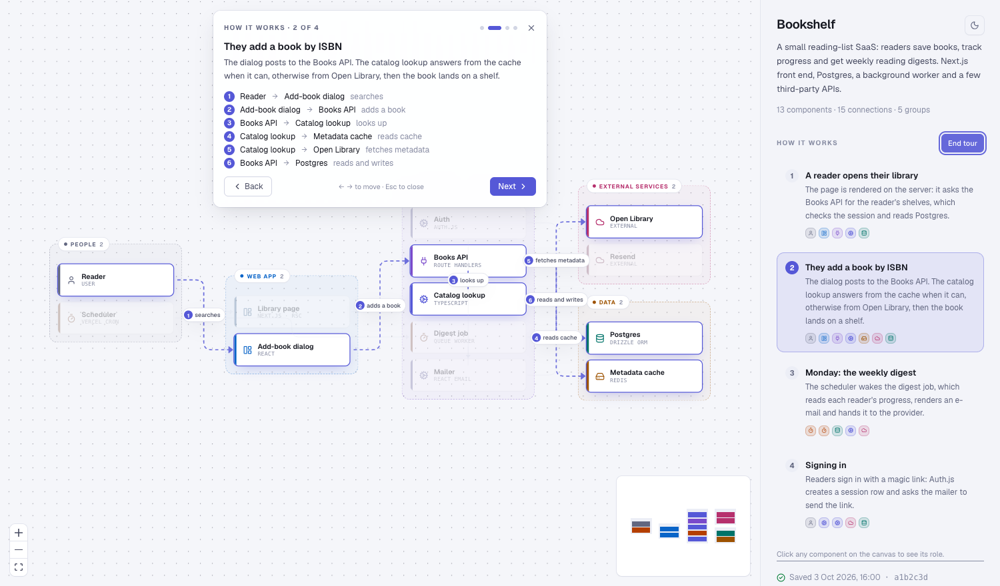
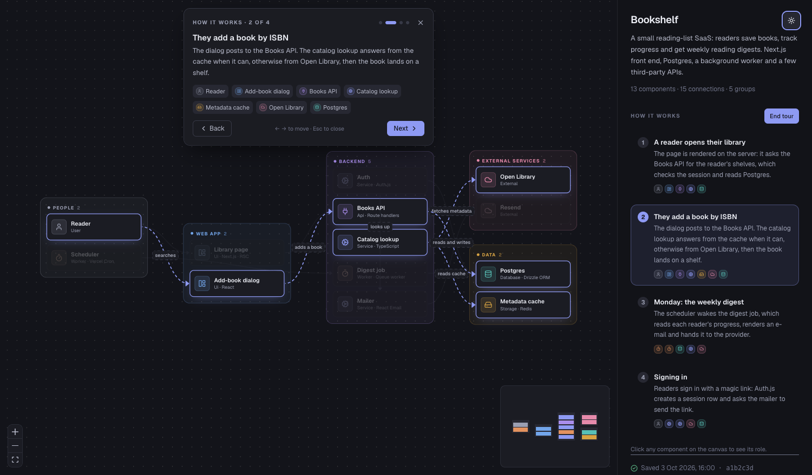
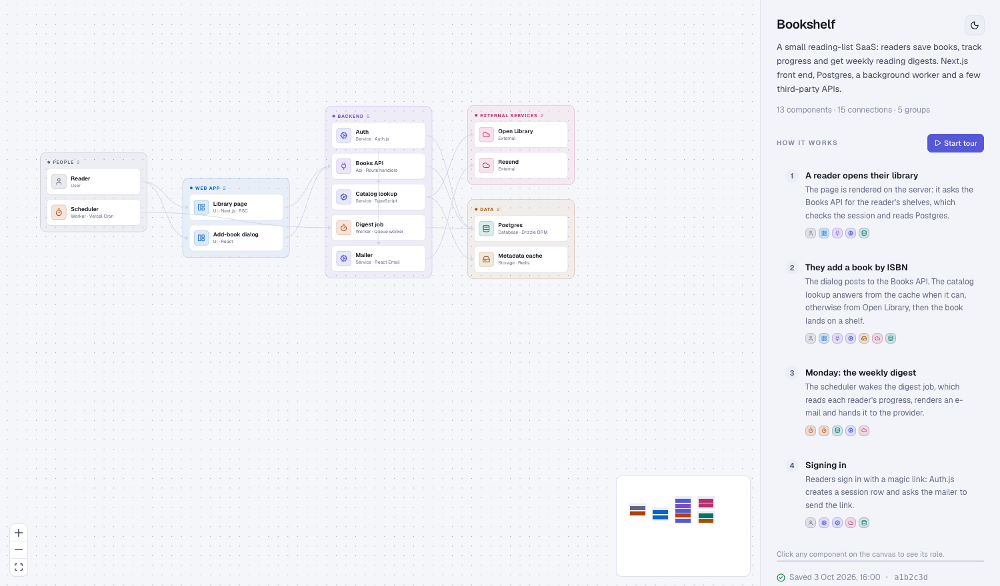

# arch-map

An agent skill that turns any codebase into an **interactive architecture map** with a guided "How it works" tour.

Run one command in a project. The agent reads the code, works out the components, how they talk to each other and the main user-visible flows, and writes a single HTML file you can open, share or commit. No dependency is added to your project.



| Dark | Overview |
| --- | --- |
|  |  |

**Try it without installing anything:** download [`examples/demo.html`](examples/demo.html) and open it in a browser.

## Why

When an AI agent builds your app, the structure appears one diff at a time and nobody holds the whole picture. `arch-map` gives you the picture back: grouped components, the real runtime connections between them, and a short tour of the flows that matter, written in plain language.

## Install

Works with Claude Code and any agent that reads `SKILL.md` skills.

```bash
# with the skills CLI
npx skills add CarlosRGL/arch-map

# or by hand (Claude Code, global)
git clone https://github.com/CarlosRGL/arch-map ~/.claude/skills/arch-map

# or per project
git clone https://github.com/CarlosRGL/arch-map .claude/skills/arch-map
```

Requirements: Node 18+ on the machine (the build script has no dependencies). `agent-browser` or any browser is optional, used to check the render.

## Use

In the project you want to map, ask your agent:

```
/arch-map
```

or just "map the architecture of this app". The agent will:

1. survey the repo (README, manifests, entry points, routes, jobs),
2. write `.arch/architecture.json`,
3. build `.arch/index.html`,
4. open it and report what it was least sure about.

Run it again later: if `.arch/architecture.json` exists the agent diffs against the saved commit and updates the map instead of starting over.

`.arch/` is not added to `.gitignore`. Commit it if you want the map in the repo, ignore it if you don't.

## Options

Ask for them in the same sentence: "map the architecture, explain it in simple English".

- **`ste`**: the agent writes every description in a controlled, simplified English modelled on [ASD-STE100](https://www.asd-ste100.org/) (short sentences, active voice, one word per meaning). Aimed at "80% of the way" so it stays readable; ask for `strict` to follow the spec fully.
- **`video`**: adds a spoken `narration` to each tour step and writes `.arch/narration.md` and `.arch/narration.json` (one scene per step, with the on-screen components and numbered hops). The agent can then render a narrated explainer video from it, with the TTS you choose. The script alone is cheap; the render takes time.

The idea comes from Andrej Karpathy's [ladder for understanding model output](https://x.com/karpathy/status/2105819303471976479): controlled writing, then diagrams, then web pages, then explainer videos. The map covers the middle two; these options cover the ends. Details in [`references/explain.md`](references/explain.md).

## What the viewer does

- Components grouped by layer, with an icon per kind: `user`, `ui`, `api`, `service`, `worker`, `cli`, `database`, `storage`, `external`, `config`.
- **How it works**: a guided tour. Each step highlights the components of one flow and animates its connections, everything else dims. The hops are **numbered 1, 2, 3…** on the map and listed in the step card, so you can read the sequence. Keyboard: `←` `→` to move, `Esc` to close.
- Click a component for its role, its in and out connections and its source files.
- Minimap, pan and zoom, light and dark mode (follows your system, toggle in the sidebar).
- Styled with the [@crdg loniar theme](https://crdg-registry.vercel.app): Geist, one indigo accent, dense type scale.
- One self-contained file: works offline, from `file://`, on any static host.

## The file format

The viewer renders `architecture.json`. Components, groups, connections and tour steps are all plain objects; the full schema with the sizing rules the agent follows is in [`references/schema.md`](references/schema.md), and a complete example is in [`examples/demo.json`](examples/demo.json).

You can also write or edit the JSON by hand and rebuild:

```bash
node scripts/build.mjs path/to/architecture.json [out.html]
```

The script validates ids, references, kinds and colors before it writes anything.

## Layout of this repo

```
SKILL.md              the procedure the agent follows
references/schema.md  architecture.json schema and sizing rules
scripts/build.mjs     validate + inject the JSON into the viewer
scripts/narration.mjs tour -> narration script and scene data (video mode)
references/explain.md ste and video options
assets/viewer.html    prebuilt viewer (generated, committed)
viewer/               viewer source: Vite, React, @xyflow/react, dagre, Tailwind v4
examples/             demo.json and the built demo.html
```

## Hacking on the viewer

```bash
cd viewer
pnpm install
pnpm build                     # outputs viewer/dist/index.html
cp dist/index.html ../assets/viewer.html
node ../scripts/build.mjs ../examples/demo.json ../examples/demo.html
```

Keep the `<script id="arch-data" type="application/json">null</script>` line in `viewer/index.html`: the build script replaces it with your data.

## Known limits

- The layout reads left to right, one column per group chain. Maps with many groups get wide, so the overview text is small; use the tour or zoom.
- The agent verifies connections by reading the code, it does not run your app. Treat the map as a good first draft and fix the JSON where it's wrong.

## License

MIT
